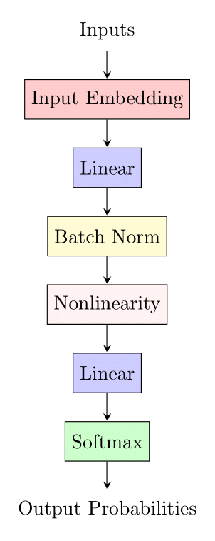

# Backpropagation

## Introduction

In this chapter, we delve into the fundamental concepts of neural network training. If the concept of derivatives is
unfamiliar to you, we recommend acquiring a basic understanding before proceeding with the tasks outlined below.

## Neural Network as a Black Box

Imagine our neural network as a black box, equipped with parameters that we can modify. This black box takes a set of
data as input and provides a corresponding output for a given task. The goal is to assess the network's performance —
how closely its outputs align with the actual results. To gauge this, we introduce the notion of a **loss function**.

### Loss Function

The loss function evaluates the similarity between the network's output and the correct answers. It assigns a positive
number as an estimate, with a lower value indicating a smaller disparity between the neural network's output and the
correct answers. As the network's output relies on its parameters, the loss function is inherently dependent on these
parameters. Consequently, for each parameter, it is crucial to comprehend its impact on the loss function.

### Gradient Calculation

To gauge the influence of each parameter on the loss function, we calculate a value known as the **gradient** (akin to a
derivative). The process of computing this value is termed the **back propagation**.

### Example

Suppose we have four parameters $a = 2, b = -3, c = 10, d = -2$ and a function $(a \cdot b + c) \cdot d $. Let's compute
the gradient of each parameter.

The gradient of $d$ is just $a \cdot b + c = 2 \cdot (-3) + 10 = 4$

The gradient of $c$ is equal to $d = -2$

The gradient of $b$ is equal to $a \cdot d = 2 \cdot (-2) = -4$

And the gradient of $a$ is equal to $b \cdot d = (-3) \cdot (-2) = 6 $

For a better understanding, we recommend watching the lecture listed at the end of this theory block

## Implementing Backward Pass

In the ensuing tasks, you will be tasked with implementing a backward pass for the neural network depicted below:

  

## Resources and Additional Materials

To enhance your understanding, explore the following resources and videos:

- [The spelled-out intro to neural networks and backpropagation: building micrograd](https://www.youtube.com/watch?v=VMj-3S1tku0&list=PLAqhIrjkxbuWI23v9cThsA9GvCAUhRvKZ)
