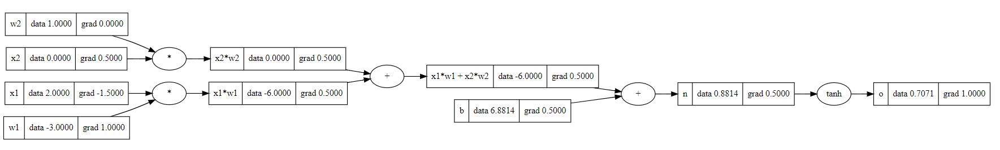

In previous tasks we wrote a neural network ourselves. However, there is a ready-made library in Python for working with backpropagation,
it is called PyTorch and its application is presented below.

This task is for demonstration purposes, you don't need to write code.

Here are the forward and backward pass implementations.
The first example uses the **Value** class we wrote and the second uses the **PyTorch** library.

Run both fragments in turn and compare the result.

Here is a visualization of forward and backward
propagation of what is happening in both tasks:

