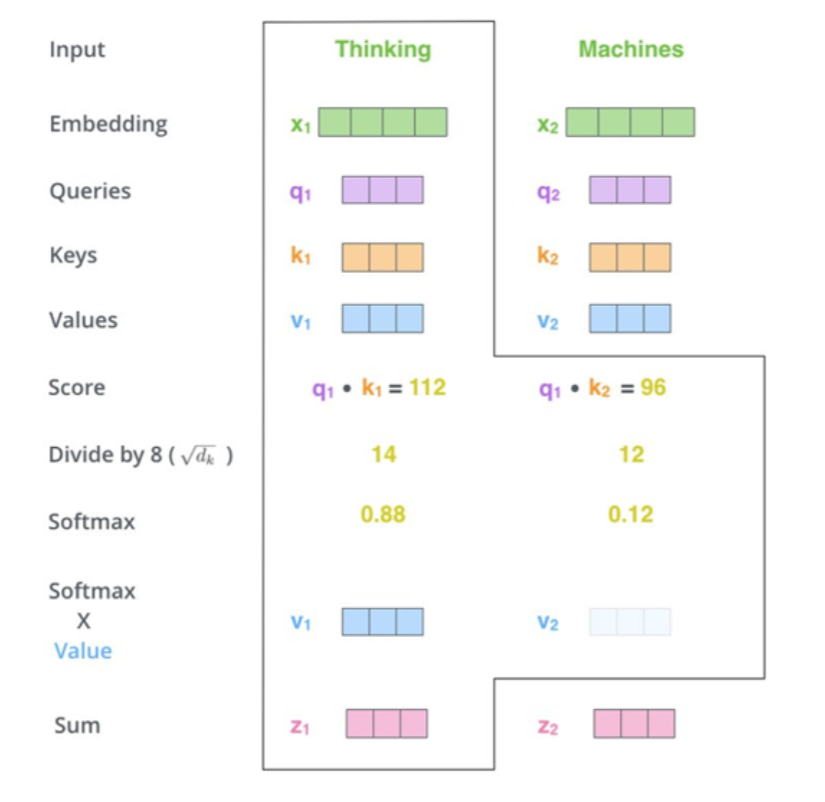

Imagine you have a bunch of tokens in a sentence, and you want to understand the meaning of each token by considering
its
relationship with other tokens. The attention mechanism in transformers is like giving each token the ability to focus
more on certain tokens in the sentence. 

Here's how it works:
1. Each token in the sentence is associated with three vectors - a query, a key, and a value. The query vector asks a
   question about the token, the key vector answers the question, and the value vector is the actual information or
   content associated with a word.
2. The query of one token compares itself with the key of every other token in the sentence (just a scalar product).
   This gives you an
   understanding of how much attention you need to pay to the rest of the tokens in the sentence.
3. To normalize the attention, we divide the result of the previous step by the square root of the dimension of the
   query vector.
4. We apply a `softmax` function to the result of the previous step to get a probability distribution over the tokens in
   the sentence.
5. We multiply the value of each token with the probability distribution of the previous step to get the weighted sum
   of the value vectors. This is the attention vector of the token.

  

## Resources

- [Attention is all you need](https://arxiv.org/pdf/1706.03762.pdf), original paper
- [Attention Mechanism in the Transformers
  ](https://medium.com/@sagarpatiler/attention-mechanism-in-the-transformers-fd067df25ea), a good explanation
- [Let's build GPT: from scratch, in code, spelled out.](https://www.youtube.com/watch?v=kCc8FmEb1nY), Karpathy's
  lecture