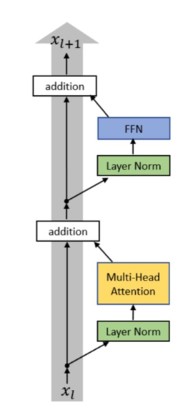

In this task you can see two classes. One of them is FeedForward. It's just a simple linear layer followed by a
non-linearity. You needn't change it. The second one is Block. It's a transformer block. You need to
implement it. One block consists the following layers:

1) First layer norm.
2) Multi-head attention.
3) Second layer norm.
4) Feed forward.

## Skip-connection

When you have a large number of layers, it's hard to train the model because of vanishing gradients. To solve this
problem, you can use skip-connections. It's a simple way to pass the information from one layer to another. You just need
to add your vector to the output of the next layers. On the picture below you can see skip-connections in the transformer block. 

  

Use skip-connections in your implementation.